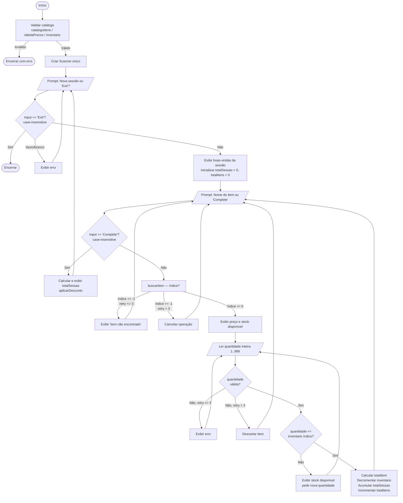

# Design Document — Supermercado Carrinho de Compras

## Overview

Este documento descreve a arquitetura técnica e as decisões de design do sistema de carrinho de compras de supermercado, implementado como uma aplicação console em **Java 21 puro**, sem frameworks, sem base de dados e sem injeção de dependência.

O sistema é uma aplicação de linha de comando (CLI) com um único ponto de entrada `main`, organizada numa única classe `Supermercado.java`. Toda a lógica é encapsulada em **métodos estáticos**, os dados residem em **arrays paralelos** em memória, e a interação com o utilizador é feita exclusivamente via um único objeto `Scanner`.

### Objetivos de design

- Consolidar o uso de arrays, loops aninhados, Scanner e métodos estáticos em Java 21.
- Garantir alinhamento estrito entre `catalogoItens`, `tabelaPrecos` e `inventario` por índice.
- Isolar a lógica de negócio (cálculos, buscas, descontos) em métodos estáticos puros e testáveis.
- Manter nomes de variáveis e métodos em português (camelCase), conforme convenção do projeto.

---

## Architecture

O sistema segue uma **arquitetura procedural estática de classe única**. Não há objetos de domínio instanciados; toda a lógica opera sobre arrays e variáveis primitivas passadas como parâmetros.

```
┌─────────────────────────────────────────────────────┐
│                  Supermercado.java                   │
│                                                     │
│  ┌──────────────────────────────────────────────┐   │
│  │  Arrays Globais (campos estáticos finais)    │   │
│  │  catalogoItens[]  tabelaPrecos[]  inventario[] │ │
│  └──────────────────────────────────────────────┘   │
│                                                     │
│  ┌──────────────────────────────────────────────┐   │
│  │  main()                                      │   │
│  │  ├── validação do catálogo (Req 1)           │   │
│  │  ├── Scanner único                           │   │
│  │  └── Loop Externo (sessões)                  │   │
│  │       └── Loop Interno (itens por sessão)    │   │
│  └──────────────────────────────────────────────┘   │
│                                                     │
│  ┌──────────────────────────────────────────────┐   │
│  │  Métodos Estáticos de Lógica                 │   │
│  │  buscarItem()           calcularMediaPrecos() │  │
│  │  filtrarItensPorPreco() aplicarDesconto()     │  │
│  │  validarCatalogo()      verificarStock()      │  │
│  └──────────────────────────────────────────────┘   │
└─────────────────────────────────────────────────────┘
```

### Decisões arquiteturais

| Decisão | Escolha | Justificação |
|---|---|---|
| Organização do código | Classe única `Supermercado.java` | Nível académico — foco em conceitos fundamentais |
| Estado dos arrays | Campos `static final` na classe | Arrays paralelos inicializados uma única vez; imutáveis em estrutura |
| Scanner | Instância única, criada em `main` | Evita múltiplos streams abertos em `System.in`; passa-se como parâmetro |
| Tipos de dados | `String[]`, `float[]`, `int[]` | Tipos primitivos e String, sem Collections — objetivo do exercício |
| Saída de resultados | `void` com `System.out.println` | Métodos de filtragem e desconto imprimem diretamente (conforme requisitos) |

---

## Components and Interfaces

### Classe `Supermercado`

Única classe do projeto. Contém todos os campos de dados e todos os métodos.

#### Campos estáticos (dados do catálogo)

```java
static final String[] catalogoItens = { /* 10–25 itens */ };
static final float[]  tabelaPrecos  = { /* preços correspondentes */ };
static       int[]    inventario    = { /* stock inicial */ };
```

> **Nota:** `inventario` é `static` mas não `final` — o stock é decrementado durante a execução.

---

### Assinaturas completas dos métodos estáticos obrigatórios

#### `buscarItem`

```java
/**
 * Procura um item no catálogo, sem distinção de maiúsculas/minúsculas.
 *
 * @param nomeItem     Nome do item a procurar. Null ou vazio retorna -1 imediatamente.
 * @param catalogoItens Array de nomes de itens disponíveis.
 * @return Índice do item no array, ou -1 se não encontrado.
 *
 * Responsabilidade: centralizar toda a lógica de pesquisa no catálogo.
 * Garante case-insensitivity via String.equalsIgnoreCase().
 */
static int buscarItem(String nomeItem, String[] catalogoItens)
```

#### `calcularMediaPrecos`

```java
/**
 * Calcula a média aritmética dos preços do catálogo.
 *
 * @param tabelaPrecos Array de preços unitários (float[]).
 * @return Média aritmética dos valores do array, ou 0.0 se o array estiver vazio.
 *
 * Responsabilidade: fornecer ao utilizador uma referência do nível de preços.
 * Usa acumulação com loop for-each; o resultado é exibido com 2 casas decimais (HALF_UP).
 */
static float calcularMediaPrecos(float[] tabelaPrecos)
```

#### `filtrarItensPorPreco`

```java
/**
 * Exibe no console os itens cujo preço unitário é estritamente menor que o limite.
 *
 * @param catalogoItens  Array de nomes dos itens.
 * @param tabelaPrecos   Array de preços correspondentes (alinhado por índice).
 * @param limiteMaximo   Valor de corte (float). Deve ser > 0.0.
 *
 * Responsabilidade: filtrar e ordenar crescentemente os itens por preço.
 * Retorno void — imprime diretamente via System.out.
 * Usa arrays temporários para coletar os itens filtrados antes de ordenar.
 * Se limiteMaximo <= 0, exibe mensagem de erro sem executar a filtragem.
 */
static void filtrarItensPorPreco(String[] catalogoItens, float[] tabelaPrecos, float limiteMaximo)
```

#### `aplicarDesconto`

```java
/**
 * Calcula e exibe o desconto aplicável à sessão, retornando o valor final.
 *
 * @param totalSessao Valor total acumulado da sessão (float). Deve ser >= 0.
 * @param totalItens  Número total de itens adicionados na sessão (int). Deve ser >= 0.
 * @return Valor final com desconto aplicado, arredondado a 2 casas decimais.
 *         Retorna 0.0 se totalSessao ou totalItens forem negativos.
 *
 * Responsabilidade: encapsular toda a lógica de descontos condicionais.
 * Regras: >= 100€ → 10%; >= 5 itens → +5%; máx 15%.
 * Exibe no console: valor original, percentual aplicado e valor final.
 */
static float aplicarDesconto(float totalSessao, int totalItens)
```

---

### Métodos estáticos auxiliares (implementação interna)

Estes métodos não fazem parte dos requisitos obrigatórios mas são necessários para um design limpo:

```java
// Valida o catálogo no arranque (tamanho, nomes, preços, inventário)
static boolean validarCatalogo(String[] catalogoItens, float[] tabelaPrecos, int[] inventario)

// Lê um inteiro do Scanner com retry (máx 3 tentativas); retorna -1 se excedido
static int lerInteiroComRetry(Scanner scanner, String prompt, int min, int max)

// Lê um nome de item não vazio; devolve "" se o utilizador digitar "Complete"
static String lerNomeItem(Scanner scanner)
```

---

## Data Models

### Arrays paralelos (estrutura central)

Os três arrays são o "modelo de dados" da aplicação. Estão sempre alinhados: a posição `i` em cada array corresponde ao mesmo produto.

```
índice:         0          1          2          3     ...
catalogoItens: "Arroz"   "Feijão"  "Azeite"  "Leite"  ...
tabelaPrecos:   1.20f     0.89f     3.49f     0.75f    ...
inventario:     50        30        20        100      ...
```

**Invariante crítica:** `catalogoItens.length == tabelaPrecos.length == inventario.length`

### Variáveis de sessão (escopo do loop externo)

Criadas/reiniciadas a cada nova sessão:

```java
float totalSessao  = 0.0f;   // acumulador do valor total da sessão
int   totalItens   = 0;      // contador de itens adicionados na sessão
```

### Variáveis de item (escopo do loop interno)

Criadas a cada iteração do loop interno:

```java
String nomeItemAtual;       // nome lido do Scanner
int    indiceItem;          // resultado de buscarItem()
int    quantidade;          // quantidade válida lida do utilizador
float  precoUnitario;       // tabelaPrecos[indiceItem]
float  totalItem;           // precoUnitario * quantidade
```

---

## Program Flow

### Diagrama de fluxo (loops aninhados)



---

## Correctness Properties

*Uma propriedade é uma característica ou comportamento que deve ser verdadeiro em todas as execuções válidas do sistema — essencialmente, uma afirmação formal sobre o que o software deve fazer. As propriedades servem como ponte entre especificações legíveis por humanos e garantias de correção verificáveis por máquina.*

---

### Property 1: Alinhamento dos arrays paralelos

*Para qualquer* estado válido da aplicação, os três arrays `catalogoItens`, `tabelaPrecos` e `inventario` devem ter o mesmo comprimento, e todos os valores de `inventario` devem ser maiores ou iguais a zero.

**Validates: Requirements 1.3, 1.4, 10.1**

---

### Property 2: Validação do catálogo rejeita tamanhos inválidos

*Para qualquer* array `catalogoItens` com comprimento fora do intervalo [10, 25], a função de validação do catálogo deve retornar `false` (ou sinalizar erro), independentemente do conteúdo dos elementos.

**Validates: Requirements 1.1, 1.2**

---

### Property 3: Validação rejeita nomes e preços inválidos

*Para qualquer* array `catalogoItens` contendo pelo menos um nome vazio, nulo ou com mais de 100 caracteres, ou qualquer array `tabelaPrecos` contendo um valor ≤ 0.0, > 999999.99, NaN ou Infinity, a validação do catálogo deve rejeitar a inicialização.

**Validates: Requirements 1.5, 1.6**

---

### Property 4: `buscarItem` localiza itens corretamente (case-insensitive)

*Para qualquer* array `catalogoItens` não vazio e *para qualquer* item presente nesse array, chamar `buscarItem` com qualquer variação de capitalização do nome desse item deve retornar o índice correto (0-based) no array.

**Validates: Requirements 5.1, 5.2**

---

### Property 5: `buscarItem` retorna -1 para itens ausentes

*Para qualquer* array `catalogoItens` e *para qualquer* string que não corresponda a nenhum elemento do array (ou que seja nula ou vazia), `buscarItem` deve retornar -1.

**Validates: Requirements 5.3**

---

### Property 6: `calcularMediaPrecos` respeita a definição de média aritmética

*Para qualquer* array `tabelaPrecos` não vazio com todos os valores > 0.0, o valor retornado por `calcularMediaPrecos` deve ser simultaneamente: (a) igual à soma de todos os elementos dividida pelo comprimento do array, e (b) estar no intervalo `[min(array), max(array)]`.

**Validates: Requirements 7.2**

---

### Property 7: `filtrarItensPorPreco` retorna apenas itens abaixo do limite, ordenados

*Para qualquer* catálogo e *para qualquer* limite > 0.0, todos os itens exibidos por `filtrarItensPorPreco` devem ter preço estritamente menor que o limite, e a sequência exibida deve estar em ordem crescente de preço.

**Validates: Requirements 8.2**

---

### Property 8: `aplicarDesconto` nunca excede 15% de desconto e respeita as regras acumuladas

*Para qualquer* `totalSessao` ≥ 0 e *para qualquer* `totalItens` ≥ 0, o desconto total aplicado por `aplicarDesconto` nunca excede 15% do `totalSessao` original. Adicionalmente:
- Se `totalSessao` ≥ 100.0, o desconto inclui sempre pelo menos 10%.
- Se `totalItens` ≥ 5, o desconto inclui sempre pelo menos 5%.
- O valor de retorno é sempre ≤ `totalSessao`.

**Validates: Requirements 9.2, 9.3, 9.4**

---

### Property 9: Acumulação correta do total da sessão

*Para qualquer* lista de itens válidos adicionados durante uma sessão (quantidade ≥ 1, preço > 0), o `totalSessao` ao final da sessão deve ser exatamente igual à soma de `(quantidade_i × precoUnitario_i)` para todos os itens `i`.

**Validates: Requirements 4.5, 6.3, 6.4**

---

### Property 10: Decremento correto do inventário após compra

*Para qualquer* item com índice `i` e *para qualquer* quantidade válida `q` aceite pelo sistema (`q` ≤ `inventario[i]` antes da compra), após a confirmação da compra, `inventario[i]` deve ser igual ao valor anterior menos `q`.

**Validates: Requirements 10.2, 10.4**

---

### Property 11: Stock nunca fica negativo

*Para qualquer* sequência de compras válidas aceites pelo sistema, nenhum elemento do array `inventario` deve ficar com valor negativo.

**Validates: Requirements 10.2, 10.4**

> **Nota de reflexão:** As Properties 10 e 11 são complementares: a Property 10 testa a correção do decremento unitário, enquanto a Property 11 testa o invariante global após múltiplas operações. Ambas têm valor único e não são redundantes.

---

## Error Handling

### Estratégia geral

O sistema usa uma abordagem de **validação antecipada (fail-fast)** na inicialização e **retry com limite** durante a interação.

### Validação na inicialização (antes de qualquer loop)

| Condição | Resposta |
|---|---|
| `catalogoItens.length < 10 \|\| > 25` | `System.err.println` + `System.exit(1)` |
| `tabelaPrecos.length != catalogoItens.length` | `System.err.println` + `System.exit(1)` |
| `inventario.length != catalogoItens.length` | `System.err.println` + `System.exit(1)` |
| Preço ≤ 0, NaN, Infinity, ou > 999999.99 | `System.err.println` + `System.exit(1)` |
| Nome de item vazio, nulo ou > 100 chars | `System.err.println` + `System.exit(1)` |
| Valor inicial de inventário < 0 | `System.err.println` + `System.exit(1)` |

### Validação de entrada do utilizador (durante execução)

| Situação | Máx. tentativas | Comportamento ao esgotar |
|---|---|---|
| Nome de item não encontrado | 3 | Cancelar adição; retornar ao prompt do item |
| Quantidade não numérica | 3 | Descartar item; retornar ao prompt do item |
| Quantidade fora de [1, 999] | 3 | Descartar item; retornar ao prompt do item |
| Quantidade > stock disponível | 3 | Descartar item; retornar ao prompt do item |
| Nome vazio no loop externo | Sem limite | Repetir prompt indefinidamente |
| Limite ≤ 0 em `filtrarItensPorPreco` | — | Exibir erro; não filtrar |
| `totalSessao` ou `totalItens` negativos em `aplicarDesconto` | — | Retornar 0.0; exibir mensagem de erro |

### Tratamento de `Scanner.nextLine()` vs `Scanner.nextInt()`

> **Atenção académica:** O uso de `nextInt()` seguido de `nextLine()` em Java deixa um `\n` residual no buffer. A estratégia adotada neste projeto é usar **exclusivamente `scanner.nextLine()`** para toda a leitura, convertendo para `int` ou `float` manualmente via `Integer.parseInt()` e `Float.parseFloat()` dentro de blocos `try-catch`. Isto evita o bug clássico do `\n` perdido.

```java
// Padrão seguro adotado em todo o projeto
try {
    int quantidade = Integer.parseInt(scanner.nextLine().trim());
    // validar intervalo...
} catch (NumberFormatException e) {
    System.out.println("Erro: valor não numérico. Tente novamente.");
}
```

---

## Testing Strategy

### Abordagem dual

O projeto adota uma abordagem de **testes em duas camadas**:

1. **Testes de unidade com exemplos** — verificam comportamentos específicos, casos extremos e condições de erro com valores concretos e conhecidos.
2. **Testes baseados em propriedades (Property-Based Testing)** — verificam invariantes universais sobre os métodos estáticos puros, executando centenas de combinações de input geradas aleatoriamente.

### Biblioteca de PBT selecionada

Para Java 21 puro, a biblioteca recomendada é **[jqwik](https://jqwik.net/)** (versão ≥ 1.8.x), que funciona sobre JUnit 5. É a opção mais madura para PBT em Java sem Spring.

Dependências Maven:
```xml
<dependency>
    <groupId>net.jqwik</groupId>
    <artifactId>jqwik</artifactId>
    <version>1.8.5</version>
    <scope>test</scope>
</dependency>
<dependency>
    <groupId>org.junit.jupiter</groupId>
    <artifactId>junit-jupiter</artifactId>
    <version>5.10.2</version>
    <scope>test</scope>
</dependency>
```

### Configuração dos testes de propriedade

- Mínimo de **100 iterações** por propriedade (`tries = 100` ou padrão jqwik).
- Cada teste de propriedade deve incluir um comentário de rastreabilidade:

```java
// Feature: supermercado-carrinho-compras, Property 4: buscarItem localiza itens corretamente (case-insensitive)
```

### Mapeamento: propriedades → testes

| Propriedade | Tipo de teste | Método de teste (sugerido) |
|---|---|---|
| Property 1: Alinhamento dos arrays | Smoke / Unit | `testArraysAlinhados()` |
| Property 2: Validação rejeita tamanhos inválidos | Property (jqwik) | `@Property void validacaoRejeita...` |
| Property 3: Validação rejeita nomes/preços inválidos | Property (jqwik) | `@Property void validacaoRejeita...` |
| Property 4: `buscarItem` case-insensitive | Property (jqwik) | `@Property void buscarItemEncontra...` |
| Property 5: `buscarItem` retorna -1 | Property (jqwik) | `@Property void buscarItemRetornaMinus1...` |
| Property 6: `calcularMediaPrecos` — média aritmética | Property (jqwik) | `@Property void mediaAritmetica...` |
| Property 7: `filtrarItensPorPreco` — filtro e ordem | Property (jqwik) | `@Property void filtroEOrdem...` |
| Property 8: `aplicarDesconto` — máx 15% e regras | Property (jqwik) | `@Property void descontoNuncaExcede15...` |
| Property 9: Acumulação da sessão | Property (jqwik) | `@Property void acumulacaoCorreta...` |
| Property 10: Decremento do inventário | Property (jqwik) | `@Property void decrementoInventario...` |
| Property 11: Stock nunca negativo | Property (jqwik) | `@Property void stockNuncaNegativo...` |

### Testes de unidade com exemplos (casos específicos)

Os seguintes casos devem ser cobertos por testes de unidade clássicos (JUnit 5):

| Cenário | Método |
|---|---|
| `calcularMediaPrecos([])` retorna 0.0 | `testMediaArrayVazio()` |
| `buscarItem(null, catalogo)` retorna -1 | `testBuscarItemNulo()` |
| `buscarItem("", catalogo)` retorna -1 | `testBuscarItemVazio()` |
| `aplicarDesconto(-1.0f, 3)` retorna 0.0 | `testDescontoTotalNegativo()` |
| `aplicarDesconto(50.0f, 2)` retorna 50.0 (sem desconto) | `testSemDesconto()` |
| `aplicarDesconto(100.0f, 5)` aplica 15% | `testDescontoMaximo()` |
| `filtrarItensPorPreco(c, p, -1.0f)` exibe erro | `testFiltroLimiteInvalido()` |
| Retry de quantidade inválida — 3 tentativas esgotadas | `testRetryQuantidadeEsgotado()` |

### Estrutura sugerida de ficheiros de teste

```
src/test/java/
└── SupermercadoTest.java          // testes de unidade (JUnit 5)
└── SupermercadoPropertyTest.java  // testes de propriedades (jqwik)
```

### Nota sobre PBT e métodos `void`

O método `filtrarItensPorPreco` tem retorno `void` e imprime diretamente. Para testá-lo com PBT, redirecione `System.out` para um `ByteArrayOutputStream` antes da chamada e analise o output capturado. Esta técnica é padrão em testes de aplicações console Java.
